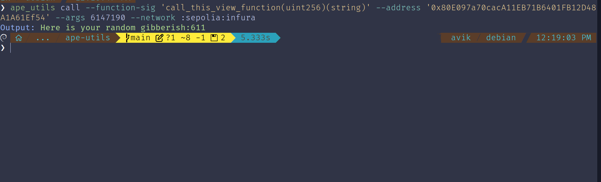

# Ape_utils

## Quick Start

Ape Utils is a CLI tool designed to interact with Ethereum smart contracts, specifically focusing on calling view functions. The tool allows you to call a view function from a given function signature and address directly from the command line.

## Demo


## Features

- **Call View Functions:** Invoke view functions on Ethereum smart contracts using their function signature and address.
- **Flexible Input:** Provide function signature, contract address, and arguments through the command line.

## Dependencies

- [python3](https://www.python.org/downloads) version 3.9 up to 3.12.

## Installation

### via `pip`

You can install the latest release via [`pip`](https://pypi.org/project/pip/):

```bash
pip install ape_utils
```

### Build locally

You can clone the repository and use [`pip`](https://github.com/pypa/pip) for the most up-to-date version:

```bash
git clone https://github.com/Aviksaikat/ape_utils.git
cd ape_utils
pip install -e .
```

## Quick Usage

Once installed, you can use the ape_utils command to call view functions on Ethereum smart contracts. Here is how you can use it:


```sh
ape_utils call --function-sig "function_signature" --address "contract_address" --args [argument] --network [ecosystem-name][:[network-name][:[provider-name]]]
```

### Examples

#### Calling a view function with single parameter

To call a view function with the signature `call_this_view_function(uint256)(string)` on a contract at address `0x80E097a70cacA11EB71B6401FB12D48A1A61Ef54` with an argument `6147190`, you can use:

```bash
# function which takes a single input parameter
ape_utils call --function-sig "call_this_view_function(uint256)(string)" --address "0x80E097a70cacA11EB71B6401FB12D48A1A61Ef54" --args '[6147190]' --network :sepolia:infura
# or
ape utils call -s "call_this_view_function(uint256)(string)" -a "0x80E097a70cacA11EB71B6401FB12D48A1A61Ef54" -ag '[6147190]' --network :sepolia:infura
```

#### Calling a view function with multiple parameter

```bash
# function which takes multiple input parameters
ape_utils call --function-sig 'couple_param_function(uint256,string)(string)' --address '0x894A02d4574318a9da4EEc7884a7D0c095E65507' --args "[6147190,'string']" --network :sepolia
```

```bash
# function with 3 input parameters
ape_utils call --function-sig 'multiple_param_function(uint256,string,address)(string)' --address '0x894A02d4574318a9da4EEc7884a7D0c095E65507' --args "[6147190,'string', '0x894A02d4574318a9da4EEc7884a7D0c095E65507']" --network :sepolia
```

### Use as ape plugin

```bash
ape utils --help
ape utils call --function-sig "call_this_view_function(uint256)(string)" --address "0x80E097a70cacA11EB71B6401FB12D48A1A61Ef54" --args '[6147190]' --network :sepolia:infura
```

#### ABI encode the given function

```sh
ape_utils encode --signature 'call_this_view_function(uint256 arg1, string addr)' 1234 '0xdeadbeef'
```

#### ABI Decode input data

```sh
ape_utils decode --signature 'call_this_view_function(uint256 arg1, string addr)' '0x00000000000000000000000000000000000000000000000000000000000004d20000000000000000000000000000000000000000000000000000000000000040000000000000000000000000000000000000000000000000000000000000000a3078646561646265656600000000000000000000000000000000000000000000'
```

#### Encode the given function with function selector

```sh
ape_utils encode --signature "call_this_view_function(uint256 arg1)" 1234
```

#### Decode the given function with function selector

```sh
ape_utils decode --signature "call_this_view_function(uint256 arg1)" "0x1e4f420d00000000000000000000000000000000000000000000000000000000000004d2"
```

#### Don't want beautiful print statements ?

You can now pass the `--raw` flag to each option to print the output data only

```sh
ape_utils encode --signature 'isLastFloor(uint256 arg1)' 1234 --raw
```

#### Read storage slots of a contract

```sh
ape utils read --address "0xDbB18e367E4A2A36A9F2AF7af8b3c743938deCF2" --slot 1 --network :sepolia
```



## Development

Please see the [contributing guide](CONTRIBUTING.md) to learn more how to contribute to this project.
Comments, questions, criticisms and pull requests are welcomed.

## Contact

For any issues or questions, please open an issue on the [GitHub repository](https://github.com/Aviksaikat/ape-utils).
